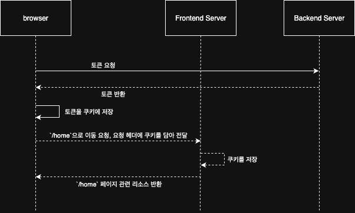

# Lorem ipsum dolor sit amet, consectetur adipiscing elit. Sed non risus. Suspendisse

## 가나다

Lorem ipsum dolor sit amet, consectetur adipiscing elit. Sed non risus. SuspendisseLorem ipsum dolor sit amet, consectetur adipiscing elit. Sed non risus.

> SuspendisseLorem ipsum dolor sit amet, consectetur adipiscing elit. Sed non risus.
> This is a first blockqute.
>> This is a second blockqute.
>>> This is a third blockqute.

1. 첫번째
2. 두번째
3. 세번째

* 빨강
  * 녹색
    * 파랑

+ 빨강
  + 녹색
    + 파랑

- 빨강
  - 녹색
    - 파랑

`hello world!`
SuspendisseLorem ipsum dolor sit amet, consectetur adipiscing elit. Sed non risus. SuspendisseLorem ipsum dolor sit amet, consectetur adipiscing elit. Sed non risus. SuspendisseLorem ipsum dolor sit amet, consectetur adipiscing elit. 

* * *

***

*****

- - -

---------------------------------------

Sed non risus. SuspendisseLorem ipsum dolor sit amet, consectetur adipiscing elit. Sed non risus.

적용예: [Google](https://google.com)

일반적인 URL 혹은 이메일주소인 경우 적절한 형식으로 링크를 형성한다.

* 외부링크: <http://example.com/>
* 이메일링크: <address@example.com>

*single asterisks*
_single underscores_
**double asterisks**
__double underscores__
~~cancelline~~



</img><br/>


* 줄 바꿈을 하기 위해서는 문장 마지막에서 3칸이상을 띄어쓰기해야 한다.
이렇게

* 줄 바꿈을 하기 위해서는 문장 마지막에서 3칸이상을 띄어쓰기해야 한다.___\\ 띄어쓰기
이렇게

SuspendisseLorem ipsum dolor sit amet, consectetur adipiscing elit. Sed non risus. Suspendisse

### 나아ㅏㄴ

Lorem ipsum dolor sit amet, consectetur adipiscing elit. Sed non risus. Suspendisse
Lorem ipsum dolor sit amet, consectetur adipiscing elit. Sed non risus. SuspendisseLorem ipsum dolor sit amet, consectetur adipiscing elit. Sed non risus. SuspendisseLorem ipsum dolor sit amet, consectetur adipiscing elit. Sed non risus. SuspendisseLorem ipsum dolor sit amet, consectetur adipiscing elit. Sed non risus. SuspendisseLorem ipsum dolor sit amet, consectetur adipiscing elit. Sed non risus. SuspendisseLorem ipsum dolor sit amet, consectetur adipiscing elit. Sed non risus. SuspendisseLorem ipsum dolor sit amet, consectetur adipiscing elit. Sed non risus. SuspendisseLorem ipsum dolor sit amet, consectetur adipiscing elit. Sed non risus. SuspendisseLorem ipsum dolor sit amet, consectetur adipiscing elit. Sed non risus. SuspendisseLorem ipsum dolor sit amet, consectetur adipiscing elit. Sed non risus. SuspendisseLorem ipsum dolor sit amet, consectetur adipiscing elit. Sed non risus. SuspendisseLorem ipsum dolor sit amet, consectetur adipiscing elit. Sed non risus. SuspendisseLorem ipsum dolor sit amet, consectetur adipiscing elit. Sed non risus. SuspendisseLorem ipsum dolor sit amet, consectetur adipiscing elit. Sed non risus. SuspendisseLorem ipsum dolor sit amet, consectetur adipiscing elit. Sed non risus. SuspendisseLorem ipsum dolor sit amet, consectetur adipiscing elit. Sed non risus. SuspendisseLorem ipsum dolor sit amet, consectetur adipiscing elit. Sed non risus. SuspendisseLorem ipsum dolor sit amet, consectetur adipiscing elit. Sed non risus. SuspendisseLorem ipsum dolor sit amet, consectetur adipiscing elit. Sed non risus. SuspendisseLorem ipsum dolor sit amet, consectetur adipiscing elit. Sed non risus. SuspendisseLorem ipsum dolor sit amet, consectetur adipiscing elit. Sed non risus. SuspendisseLorem ipsum dolor sit amet, consectetur adipiscing elit. Sed non risus. SuspendisseLorem ipsum dolor sit amet, consectetur adipiscing elit. Sed non risus. SuspendisseLorem ipsum dolor sit amet, consectetur adipiscing elit. Sed non risus. SuspendisseLorem ipsum dolor sit amet, consectetur adipiscing elit. Sed non risus. SuspendisseLorem ipsum dolor sit amet, consectetur adipiscing elit. Sed non risus. SuspendisseLorem ipsum dolor sit amet, consectetur adipiscing elit. Sed non risus. SuspendisseLorem ipsum dolor sit amet, consectetur adipiscing elit. Sed non risus. SuspendisseLorem ipsum dolor sit amet, consectetur adipiscing elit. Sed non risus. SuspendisseLorem ipsum dolor sit amet, consectetur adipiscing elit. Sed non risus. SuspendisseLorem ipsum dolor sit amet, consectetur adipiscing elit. Sed non risus. SuspendisseLorem ipsum dolor sit amet, consectetur adipiscing elit. Sed non risus. SuspendisseLorem ipsum dolor sit amet, consectetur adipiscing elit. Sed non risus. SuspendisseLorem ipsum dolor sit amet, consectetur adipiscing elit. Sed non risus. SuspendisseLorem ipsum dolor sit amet, consectetur adipiscing elit. Sed non risus. SuspendisseLorem ipsum dolor sit amet, consectetur adipiscing elit. Sed non risus. SuspendisseLorem ipsum dolor sit amet, consectetur adipiscing elit. Sed non risus. SuspendisseLorem ipsum dolor sit amet, consectetur adipiscing elit. Sed non risus. SuspendisseLorem ipsum dolor sit amet, consectetur adipiscing elit. Sed non risus. SuspendisseLorem ipsum dolor sit amet, consectetur adipiscing elit. Sed non risus. SuspendisseLorem ipsum dolor sit amet, consectetur adipiscing elit. Sed non risus. SuspendisseLorem ipsum dolor sit amet, consectetur adipiscing elit. Sed non risus. SuspendisseLorem ipsum dolor sit amet, consectetur adipiscing elit. Sed non risus. SuspendisseLorem ipsum dolor sit amet, consectetur adipiscing elit. Sed non risus. SuspendisseLorem ipsum dolor sit amet, consectetur adipiscing elit. Sed non risus. SuspendisseLorem ipsum dolor sit amet, consectetur adipiscing elit. Sed non risus. SuspendisseLorem ipsum dolor sit amet, consectetur adipiscing elit. Sed non risus. SuspendisseLorem ipsum dolor sit amet, consectetur adipiscing elit. Sed non risus. SuspendisseLorem ipsum dolor sit amet, consectetur adipiscing elit. Sed non risus. SuspendisseLorem ipsum dolor sit amet, consectetur adipiscing elit. Sed non risus. SuspendisseLorem ipsum dolor sit amet, consectetur adipiscing elit. Sed non risus. SuspendisseLorem ipsum dolor sit amet, consectetur adipiscing elit. Sed non risus. SuspendisseLorem ipsum dolor sit amet, consectetur adipiscing elit. Sed non risus. SuspendisseLorem ipsum dolor sit amet, consectetur adipiscing elit. Sed non risus. SuspendisseLorem ipsum dolor sit amet, consectetur adipiscing elit. Sed non risus. SuspendisseLorem ipsum dolor sit amet, consectetur adipiscing elit. Sed non risus. SuspendisseLorem ipsum dolor sit amet, consectetur adipiscing elit. Sed non risus. SuspendisseLorem ipsum dolor sit amet, consectetur adipiscing elit. Sed non risus. SuspendisseLorem ipsum dolor sit amet, consectetur adipiscing elit. Sed non risus. SuspendisseLorem ipsum dolor sit amet, consectetur adipiscing elit. Sed non risus. SuspendisseLorem ipsum dolor sit amet, consectetur adipiscing elit. Sed non risus. SuspendisseLorem ipsum dolor sit amet, consectetur adipiscing elit. Sed non risus. SuspendisseLorem ipsum dolor sit amet, consectetur adipiscing elit. Sed non risus. SuspendisseLorem ipsum dolor sit amet, consectetur adipiscing elit. Sed non risus. Suspendisse
Lorem ipsum dolor sit amet, consectetur adipiscing elit. Sed non risus. SuspendisseLorem ipsum dolor sit amet, consectetur adipiscing elit. Sed non risus. SuspendisseLorem ipsum dolor sit amet, consectetur adipiscing elit. Sed non risus. SuspendisseLorem ipsum dolor sit amet, consectetur adipiscing elit. Sed non risus. Suspendisse


#### ㄴㅁㄴㅇㄴㅁㅇ123213123213123


Lorem ipsum dolor sit amet, consectetur adipiscing elit. Sed non risus. Suspendisse


Lorem ipsum dolor sit amet, consectetur adipiscing elit. Sed non risus. Suspendisse


Lorem ipsum dolor sit amet, consectetur adipiscing elit. Sed non risus. Suspendisse


##### ㄴㅁㅇㅁㄴㅇ

```tsx title="page.tsx"
export default async function Post({
  params,
}: {
  params: Promise<{ slug: string }>;
}) {
  const slug = (await params).slug;
  const post = getPostBySlug(slug);

  if (post == null) notFound();

  return (
    <article className="container">
      <h1>{post.title}</h1>
      {post.cover && (
        <Image
          src={post.cover}
          alt={post.title}
          width={100}
          height={100}
          className="mt-4 rounded-lg"
        />
      )}
      <p className="mt-2 text-muted-foreground">
        {new Date(post.date).toLocaleDateString("ko-KR")}
        {post.metadata.readingTime}분 읽기
      </p>
      <MDXContent code={post.content} />
    </article>
  );
}
```

this example
